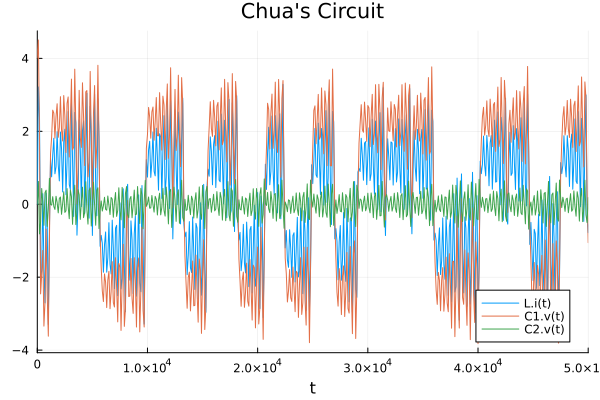

## Description

Chua's circuit is a simple electronic circuit that exhibits classic chaotic behavior.
It produces an oscillating waveform that never repeats.
The ease of construction of the circuit has made it a ubiquitous real-world example of a chaotic system, leading some to declare it "a paradigm for chaos" [^1].

From [Wikipedia](https://www.wikiwand.com/en/Chua%27s_circuit).

The code at `chua.jl` models the Chua circuit using [`ModelingToolkit.jl`](https://github.com/SciML/ModelingToolkit.jl) and the convenient [`ModelingToolkitStandardLibrary.jl`](https://github.com/SciML/ModelingToolkitStandardLibrary.jl), and, more specifically, its [Electrical components](https://docs.sciml.ai/ModelingToolkitStandardLibrary/stable/API/electrical/).

In order to get this chaotic behavior, we need to satisfy a couple requirements.

We need at least one nonlinear element if you look at the diagram above, and that's what $N_R$ stands for, our nonlinear resistor.
We need at least one locally active resistor, which is also $N_R$ in the diagram.
Then, we need at least three energy storage elements, so that's where the capacitors $C_1$ and $C_2$ and the inductor $L$ come into play.
That diagram is what we're going to be building.
This is the resulting output according to the sims on the model that we've built:

[^1]: Madan, R. N. (Ed.). (1993). *Chua's circuit: a paradigm for chaos* (Vol. 1). World Scientific.
